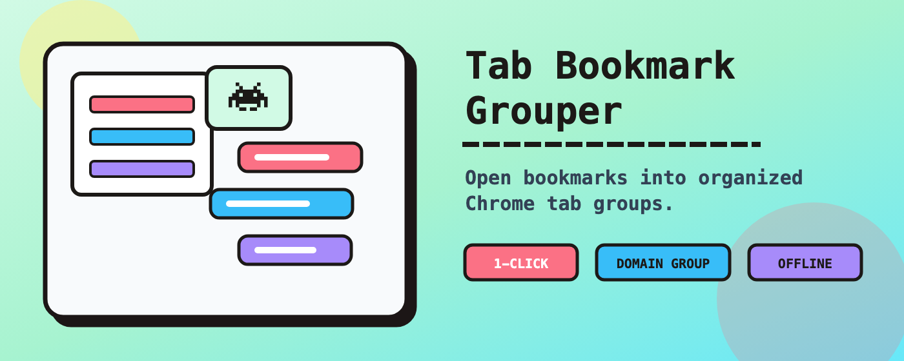
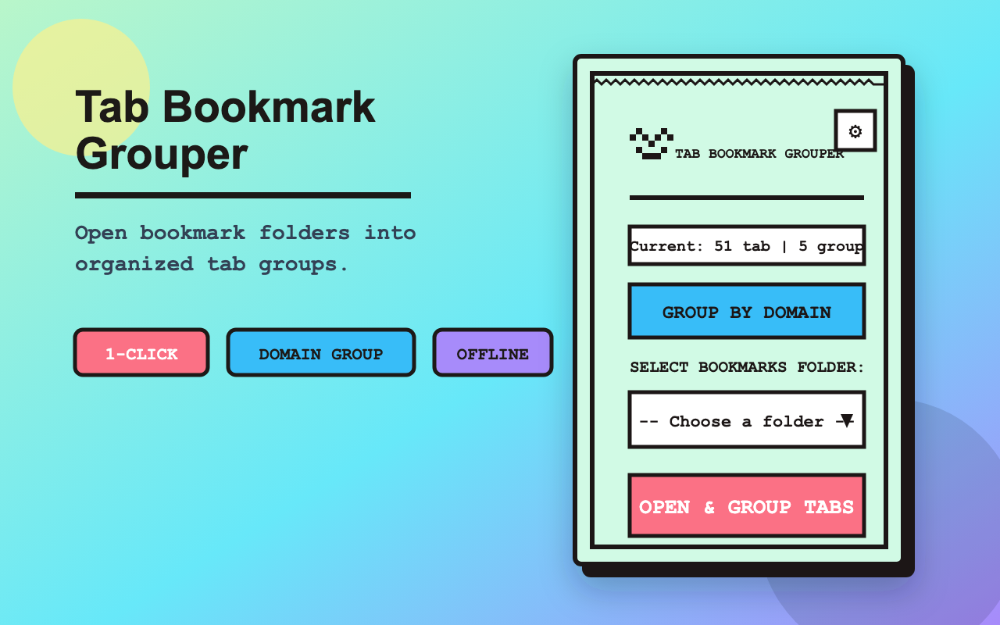
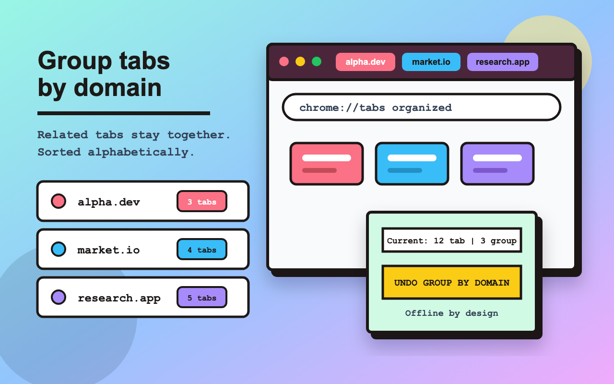

<div align="center">
  
  
  # Tab Bookmark Grouper 👾
  
  **Open bookmarks into clear, color-coded tab groups in one click.**
  <br><br>
  
  
  [](#)
  [](#)
  [](#)
</div>

---

## 😫 The Pain (Nỗi Đau)
If you do research, development, or shopping, you probably suffer from:
- **Tab Overload**: Having 50+ tabs open, making the browser laggy and tabs unreadable.
- **Context Switching**: Trying to find that one specific documentation tab hidden among YouTube and Twitter tabs.
- **Setup Time & Syncing**: Struggling to sync your workspace across devices, or wasting time manually sharing and setting up tabs for classes and workshops.
- **Manual Grouping is Tedious**: Chrome's native Tab Groups are great, but manually right-clicking and naming groups for dozens of tabs is exhausting.

## 💡 The Solution (Giải Pháp)
**Tab Bookmark Grouper** automates the tedious work. Just organize your links in Chrome Bookmarks (e.g., a folder named "Project Research"), open the extension, select the folder, and click **Open & Group**. 

The extension opens those links and bundles them into a neat, color-coded Chrome Tab Group named after your bookmark folder.

---

## ✨ Features (Tính Năng Chính)

| Feature | Description |
| :--- | :--- |
| 🗂️ **1-Click Grouping** | Select a bookmark folder and instantly open all links inside a neatly named Tab Group. |
| 🌐 **Group by Domain** | Automatically detect and group tabs belonging to the same website (e.g., all `github.com` tabs). |
| ↩️ **Smart Undo** | Made a mistake? Click "Undo" to instantly restore tabs to their original ungrouped state. |
| 💾 **Session Export/Import** | Save your current workspace (all tabs and groups) to an offline `.btg` file. Restore it anywhere. |
| 🎨 **Focused UI** | Neo-Brutalism-inspired design with dark mode, clear controls, and keyboard-accessible interactions. |
| 🛡️ **Local-first Privacy** | No tracking, no analytics, and no external APIs. Bookmark, tab, and session data stay local. |

---

## 🚀 Installation (Cài Đặt)

### Method 1: Chrome Web Store (Coming Soon)
- Click [here](#) to download directly from the Chrome Web Store.

### Method 2: Developer Mode (Local)
1. Download or clone this repository.
2. Open Chrome and navigate to `chrome://extensions/`.
3. Enable **Developer mode** in the top right corner.
4. Click **Load unpacked** and select the folder containing this extension.

---

## 🛠️ Usage (Hướng Dẫn Sử Dụng)

### 1. Open & Group Bookmarks (Mở & Gộp Bookmark)
- Click the Extension icon.
- Select a Bookmark folder from the **Select Folder** dropdown.
- Click the **Open & Group** button. All links inside will open and bundle into a neat, color-coded Tab Group.

<p align="center"></p>

### 2. Auto-Group Open Tabs (Tự Động Gộp Tab Đang Mở)
- Click the **Filter icon (Sort/Group Tabs)** on the right side of the toolbar.
- Click **Group by Website (Nhóm theo trang web)**. The extension will scan all ungrouped tabs and group them by root domain (e.g., all `github.com` tabs go into one group).
- Made a mistake? Click **Undo Grouping (Hoàn tác nhóm)** to revert the changes.

<p align="center"></p>

### 3. Session Sync & Team Sharing (Đồng Bộ & Chia Sẻ Phiên)
- **Export Session:** Click to download a `.btg` file (automatically saved to your browser's default `Downloads` folder). This saves supported windows, tabs, and groups locally.
  - *🤝 Pro Tip for Teams/Teachers:* You can send this `.btg` file to colleagues or students so they can restore supported workspace tabs without manually sharing dozens of links.
- **Import Session:** Upload a `.btg` file. The extension restores supported windows, tabs, and tab groups, reports partial failures, and cleans up empty startup tabs when safe.

### 4. Settings (Cài Đặt)
- Click the Gear icon ⚙️ to switch between **Light/Dark Auto themes** or change the language (English/Vietnamese).

---

## 🔒 Local-First & Private (Bảo mật cục bộ)
This extension does **not** collect, track, sell, transmit, or share your bookmark data, tab URLs, session exports, analytics, or telemetry with external servers.
- **Zero External APIs in the Extension Package**: Runtime extension features are processed locally.
- **No PII Collection**: The extension does not request `identity` or `email` permissions.
- **Local Settings Only**: Theme and language are stored in `chrome.storage.local`.
- **User-Controlled Session Files**: Exported `.btg` files may contain tab URLs and group metadata. Import is gated by validation and a confirmation summary.

## 📦 Release Build
Build the Chrome Web Store ZIP with:

```sh
sh scripts/build-release.sh
```

Upload `dist/bookmark-tab-grouper-<version>.zip`. The release script reads the version from `manifest.json`, excludes repository-only docs, generators, tests, `.DS_Store`, and fails if remote script/font references are found in the packaged extension.

Release history is documented in [CHANGELOG.md](CHANGELOG.md). Update it before uploading a new Chrome Web Store package so each version has clear user-facing notes.

<div align="center">
  <h3>🙏 Thank You! (Cảm Ơn!)</h3>
  <p>Thank you so much for installing and using <b>Tab Bookmark Grouper</b>. I built this tool to solve my own productivity chaos, and I truly hope it brings a little more peace and order to your digital workspace. Have a wonderful and productive day!</p>
  <i>— Created with ❤️ and Neo-brutalism by <b>Hoang Tat</b></i>
</div>
