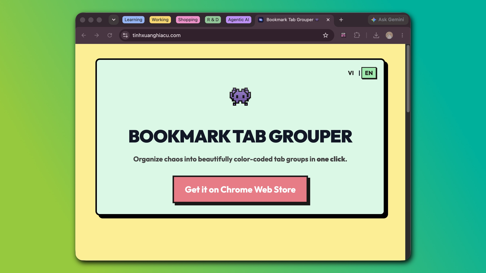
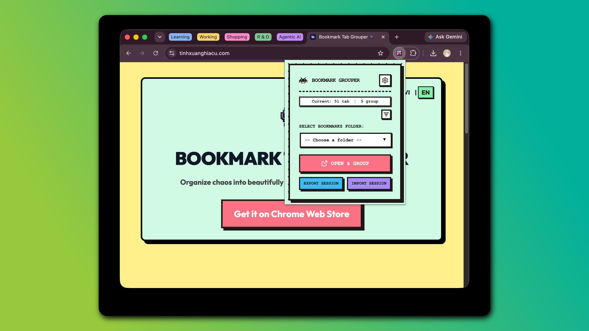
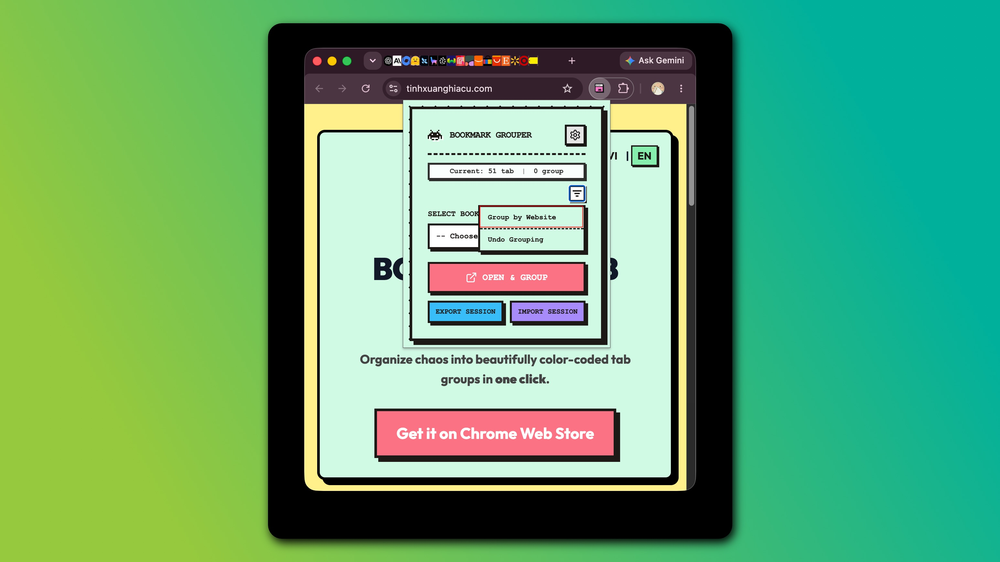

  
  
  # Bookmark Tab Grouper 👾
  
  **Organize chaos into beautifully color-coded tab groups in one click.**
    
  
  
  
  
  

---

## 😫 The Pain (Nỗi Đau)
If you do research, development, or shopping, you probably suffer from:
- **Tab Overload**: Having 50+ tabs open, making the browser laggy and tabs unreadable.
- **Context Switching**: Trying to find that one specific documentation tab hidden among YouTube and Twitter tabs.
- **Setup Time & Syncing**: Struggling to sync your workspace across devices, or wasting time manually sharing and setting up tabs for classes and workshops.
- **Manual Grouping is Tedious**: Chrome's native Tab Groups are great, but manually right-clicking and naming groups for dozens of tabs is exhausting.

## 💡 The Solution (Giải Pháp)
**Bookmark Tab Grouper** automates the tedious work. Just organize your links in Chrome Bookmarks (e.g., a folder named "Project Research"), open the extension, select the folder, and click **Open & Group**. 

BAM! 💥 The extension opens all those links and automatically bundles them into a neat, color-coded Chrome Tab Group named exactly after your bookmark folder.

---

## ✨ Features (Tính Năng Chính)

| Feature | Description |
| :--- | :--- |
| 🗂️ **1-Click Grouping** | Select a bookmark folder and instantly open all links inside a neatly named Tab Group. |
| 🌐 **Group by Domain** | Automatically detect and group tabs belonging to the same website (e.g., all `github.com` tabs). |
| ↩️ **Smart Undo** | Made a mistake? Click "Undo" to instantly restore tabs to their original ungrouped state. |
| 💾 **Session Export/Import** | Save your current workspace (all tabs and groups) to an offline `.btg` file. Restore it anywhere. |
| 🎨 **Premium UI** | Stunning Neo-Brutalism design with Dracula Dark Mode. Built-in smart hover effects and animations. |
| 🛡️ **100% Privacy** | No tracking. No analytics. No PII (Personally Identifiable Information). Everything works completely offline. |

---

## 🚀 Installation (Cài Đặt)

### Method 1: Chrome Web Store (Coming Soon)
- Click [here](#) to download directly from the Chrome Web Store.

### Method 2: Developer Mode (Local)
1. Download or clone this repository.
2. Open Chrome and navigate to `chrome://extensions/`.
3. Enable **Developer mode** in the top right corner.
4. Click **Load unpacked** and select the folder containing this extension.

---

## 🛠️ Usage (Hướng Dẫn Sử Dụng)

### 1. Open & Group Bookmarks (Mở & Gộp Bookmark)
- Click the Extension icon.
- Select a Bookmark folder from the **Select Folder** dropdown.
- Click the **Open & Group** button. All links inside will open and bundle into a neat, color-coded Tab Group.

### 2. Auto-Group Open Tabs (Tự Động Gộp Tab Đang Mở)
- Click the **Filter icon (Sort/Group Tabs)** on the right side of the toolbar.
- Click **Group by Website (Nhóm theo trang web)**. The extension will scan all ungrouped tabs and group them by root domain (e.g., all `github.com` tabs go into one group).
- Made a mistake? Click **Undo Grouping (Mặc định lại)** to revert the changes.

### 3. Session Sync & Team Sharing (Đồng Bộ & Chia Sẻ Phiên)
- **Export Session:** Click to download a `.btg` file (automatically saved to your browser's default `Downloads` folder). This securely saves your entire multi-window layout, including all tabs and groups.
  - *🤝 Pro Tip for Teams/Teachers:* You can send this `.btg` file to your colleagues or students. When they import it, they will instantly have the exact same workspace environment and websites opened without having to send dozens of links!
- **Import Session:** Upload a `.btg` file. The extension will automatically reconstruct your windows, tabs, and tab groups exactly as you left them, and automatically clean up any empty tabs!

### 4. Settings (Cài Đặt)
- Click the Gear icon ⚙️ to switch between **Light/Dark Auto themes** or change the language (English/Vietnamese).

---

## 🔒 100% Offline & Private (Bảo Mật Tuyệt Đối)
This extension is built for the absolute highest tier of privacy and compliance. **It does NOT collect, track, store, or transmit ANY of your data, browsing history, or bookmarks.** 
- **Zero External APIs**: Everything is processed locally on your machine.
- **No PII Collection**: We do not request `identity` or `email` permissions.
- **Offline First**: Works flawlessly even without an internet connection (excluding loading external web pages).

  <h3>🙏 Thank You! (Cảm Ơn!)</h3>
  
Thank you so much for installing and using <b>Bookmark Tab Grouper</b>. I built this tool to solve my own productivity chaos, and I truly hope it brings a little more peace and order to your digital workspace. Have a wonderful and productive day!

  <i>— Created with ❤️ and Neo-brutalism by <b>Hoang Tat</b></i>

